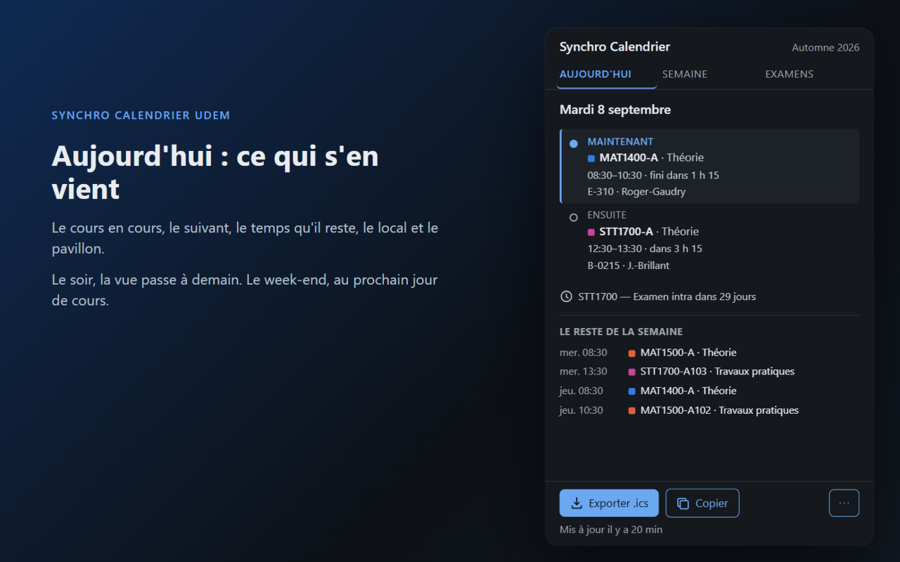
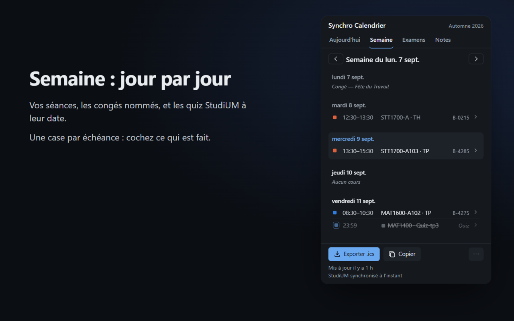
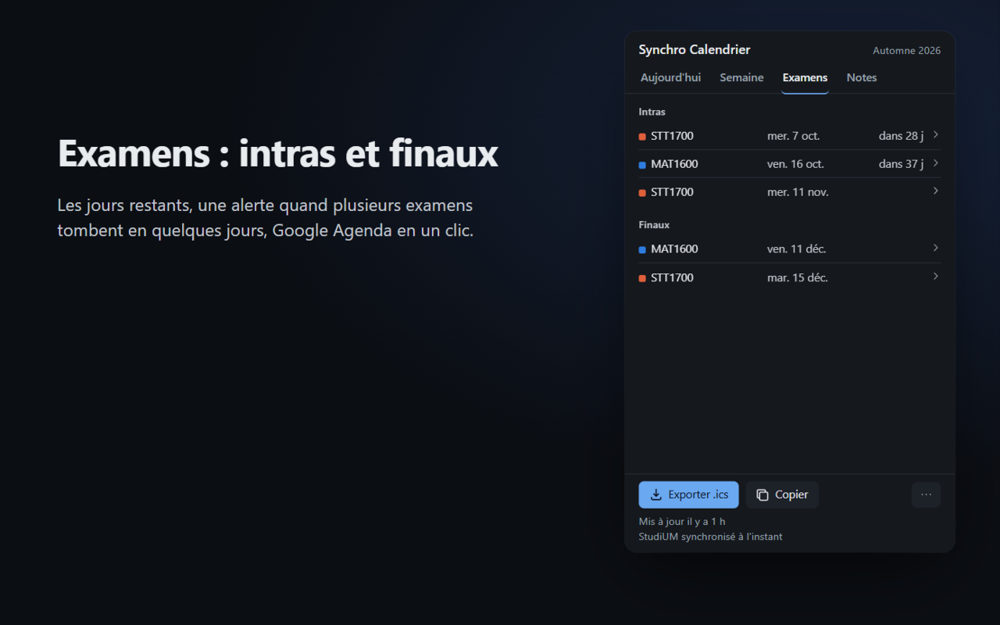

# Synchro Calendrier UdeM

Extension Chrome qui transforme l'horaire du Centre étudiant de l'Université de Montréal
(Synchro) en un vrai calendrier : un fichier `.ics` à importer dans Google Agenda, Outlook
ou Apple Calendrier, la liste de vos conflits d'horaire, et un compte à rebours des
examens directement sur l'icône de la barre d'outils.

**Tout se passe dans votre navigateur.** Aucun serveur, aucun compte, aucune clé d'API :
l'extension lit la page Synchro que vous avez vous-même ouverte, garde le résultat dans le
stockage local de Chrome, et n'envoie rien nulle part. Voir
[docs/PRIVACY.md](docs/PRIVACY.md).







## Ce qu'elle fait

- **Aujourd'hui** — le cours en cours, le suivant, le temps qu'il reste, le local et le
  pavillon. Le soir, la vue passe à demain ; le week-end, au prochain jour de cours.
- **Semaine** — vos séances jour par jour, congés et relâche nommés, navigation d'une
  semaine à l'autre, détails au clic (plages de dates, copier le local, carte du campus).
- **Examens** — intras et finaux séparés, jours restants, alerte quand plusieurs examens
  tombent en quelques jours, ajout d'un examen à Google Agenda en un clic.
- **Export `.ics`** — les séances hebdomadaires deviennent des événements récurrents avec
  local et volet, les examens des événements datés avec rappels 24 h et 1 h avant. La
  semaine de relâche et les jours fériés sont retirés automatiquement.
- **Conflits** — deux séances qui se chevauchent ou un cours pendant un examen : signalé
  dans Aujourd'hui et Semaine.
- **Badge** — l'icône affiche le nombre de cours qu'il vous reste aujourd'hui.
- **Échéances StudiUM** — ouvrez StudiUM une fois : vos quiz et devoirs (fenêtre
  d'ouverture, date limite, lien direct vers l'activité) apparaissent dans Aujourd'hui et
  Semaine, et dans le `.ics`. Sans jeton ni mot de passe : l'extension interroge le
  calendrier de StudiUM avec la session que vous avez déjà ouverte, au plus une fois par
  demi-heure (menu ⋯ → **Synchroniser StudiUM** pour forcer).
- **Événements à la main** — un rendez-vous, une remise, une séance de révision : menu ⋯ →
  **Ajouter un événement**. Chaque échéance affiche sa provenance (StudiUM ou ajoutée à la
  main) ; une échéance StudiUM retirée ne revient pas à la synchronisation suivante.
- **Repli « coller mon horaire »** — si l'extraction automatique échoue, copiez-collez le
  texte de la page depuis le menu ⋯ ; le résultat est le même.

## Installation

L'extension n'est pas encore publiée sur le Chrome Web Store. Pour l'installer à partir
des sources :

```bash
git clone https://github.com/AMoncade/synchro-calendrier.git
cd synchro-calendrier
npm ci
npm run build
```

Puis dans Chrome :

1. Ouvrez `chrome://extensions`.
2. Activez le **mode développeur** (interrupteur en haut à droite).
3. Cliquez sur **Charger l'extension non empaquetée** et choisissez le dossier `dist/`
   créé par `npm run build`.

L'icône du calendrier apparaît dans la barre d'outils. Épinglez-la pour voir le badge des
cours restants dans la journée.

## Utilisation

1. Connectez-vous au **Centre étudiant** sur Synchro.
2. Ouvrez **Horaire hebdomadaire** (choisissez le trimestre si on vous le demande).
3. Basculez sur la vue **Liste**. L'extension capture l'horaire au passage.

Cliquez ensuite sur l'icône de l'extension : les onglets Aujourd'hui, Semaine et Examens
sont remplis. Le bouton **Exporter .ics** télécharge un fichier `horaire-udem-A26.ics`.

La page Centre étudiant seule donne un horaire partiel, sans dates de début et de fin ni
examens. C'est la vue **Liste** qui contient tout : passez toujours par elle.

### Échéances StudiUM

Ouvrez [StudiUM](https://studium.umontreal.ca/my/) connecté : l'extension lit le calendrier
des cinq prochains mois et la liste de vos sites de cours. Un quiz qui « s'ouvre » puis « se
termine » devient une seule échéance avec sa fenêtre. Les sites sont rattachés à vos cours
Synchro par le sigle (`MAT1400-AB-A26` → MAT 1400) ; si un site ne correspond pas, menu ⋯ →
**Lier les sites StudiUM**. Les intras et finaux restent ceux de Synchro : StudiUM est un
complément, pas une deuxième source d'examens.

### Importer le fichier `.ics`

- **Google Agenda** — [Paramètres → Importer et exporter](https://calendar.google.com/calendar/r/settings/export),
  sélectionnez le fichier, choisissez l'agenda de destination, puis **Importer**. Créez au
  besoin un agenda dédié « UdeM » d'abord : vous pourrez le masquer ou le supprimer d'un
  coup.
- **Outlook** (web) — **Calendrier → Ajouter un calendrier → Charger à partir d'un
  fichier**. Dans Outlook pour Windows : **Fichier → Ouvrir et exporter → Importer/Exporter
  → Importer un fichier iCalendar (.ics)**, puis **Importer**.
- **Apple Calendrier** (macOS, iOS) — double-cliquez le fichier, ou **Fichier → Importer**,
  et choisissez le calendrier de destination.

Les événements portent le fuseau `America/Toronto` et des identifiants stables : réimporter
le fichier après un changement d'horaire met à jour les événements existants dans Google
Agenda et Outlook. Un agenda dédié « UdeM » reste pratique pour tout masquer ou supprimer
d'un coup.

## Limites connues

- **Le calendrier universitaire est codé en dur, trimestre par trimestre.** Les trimestres
  couverts sont Automne 2026, Hiver 2027 et Été 2027. Au-delà, les dates de relâche et de
  congés doivent être ajoutées dans `src/core/calendar-udem.ts`, chaque date étant vérifiée
  sur le site du Bureau du registraire.
- **Les dates de début et de fin de cours viennent du calendrier de la FAS** (Faculté des
  arts et des sciences) pour l'automne 2026 et l'hiver 2027. Le registraire ne publie ni le
  dernier jour de cours ni la période d'examens : une autre faculté peut différer de
  quelques jours. Vérifiez les bornes de trimestre si vous n'êtes pas à la FAS.
- **Heures arrondies.** Synchro affiche les fins de séance en `:29` (par exemple
  `08:30 - 10:29`) ; l'extension les arrondit à `:30` pour éviter des blocs de calendrier
  décalés d'une minute.
- **Séances sans jour fixe.** Une séance « À communiquer » n'a pas de créneau : elle est
  gardée comme note sur le cours, jamais placée dans le `.ics`.
- **Export ponctuel, pas une synchronisation.** Le fichier est une photo de votre horaire
  au moment de l'export. Un changement de section ou d'examen demande un nouvel export.
- **StudiUM : quiz et devoirs seulement, et seulement s'ils ont une date.** Un devoir sans
  date d'échéance configurée par l'enseignant est invisible au calendrier Moodle, donc à
  l'extension. Les notes ne sont pas lues. Le format de l'API interne de Moodle peut changer
  d'une version à l'autre ; la synchronisation échoue alors proprement (message dans le
  pied du popup) sans toucher à l'horaire.
- **Interface française de Synchro seulement**, et pages du premier cycle telles
  qu'observées à l'automne 2026. Un changement de gabarit PeopleSoft peut casser
  l'extraction ; le mode « coller mon horaire » sert alors de repli.

## Développement

```bash
npm ci                      # installer les dépendances (Node 24)
npx vitest run              # tests unitaires
npm run build               # tsc --noEmit + build Vite → dist/
npm run icons               # régénérer les PNG depuis assets/icon.svg
npm run package             # build + zip prêt pour le Chrome Web Store
npm run store-shots         # captures 1280×800 depuis docs/store/raw-N.png
```

`src/core/` est pur et déterministe : aucune API navigateur, aucun `Date.now()` caché.
L'instant courant est toujours passé en paramètre, ce qui rend les tests reproductibles.
La structure du projet, le contrat de données et ce qui a été observé sur Synchro sont
documentés dans [docs/ARCHITECTURE.md](docs/ARCHITECTURE.md).

Les bogues se signalent sur la
[page des issues](https://github.com/AMoncade/synchro-calendrier/issues), ou depuis le lien
« Signaler un bug » du popup, qui pré-remplit la version et le trimestre sans joindre
aucune donnée d'horaire.

## Quand l'UdeM change son affichage

Le seul point de rupture de l'extension est le HTML de Synchro. Si un jour le popup reste
vide ou affiche « Aucun cours reconnu » alors que la page « Votre horaire cours » est bien
ouverte en vue Liste :

1. **Dépannez tout de suite** avec le menu ⋯ → « Coller un horaire » : sélectionnez tout le
   texte de la page (Ctrl+A, Ctrl+C), collez-le, importez. Le texte suit rarement les
   mêmes changements que le HTML, donc ce repli survit souvent à une refonte.
2. **Signalez le problème** (menu ⋯ → « Signaler un bug ») : l'issue est préremplie avec la
   version de l'extension et le trimestre, jamais avec vos données.
3. **Pour contribuer un correctif** : la structure observée de Synchro est décrite dans
   `docs/ARCHITECTURE.md` §5 ; l'extraction est dans `src/content/extract.ts` (localisation
   des tableaux par le texte de leurs en-têtes, jamais par les identifiants PeopleSoft) et
   le parsing du texte dans `src/core/parse.ts`. Les fixtures réelles anonymisées sont dans
   `tests/fixtures/` : ajoutez la nouvelle page (anonymisée avec
   `node scripts/scrub-fixture.mjs <fichier>`), faites passer `npx vitest run`, ouvrez une
   pull request. Sans fixture, un correctif de parser n'est pas vérifiable.

## Licence

MIT.

Projet indépendant, sans lien avec l'Université de Montréal. « Synchro », « Centre
étudiant » et le nom de l'Université de Montréal appartiennent à leurs titulaires.
